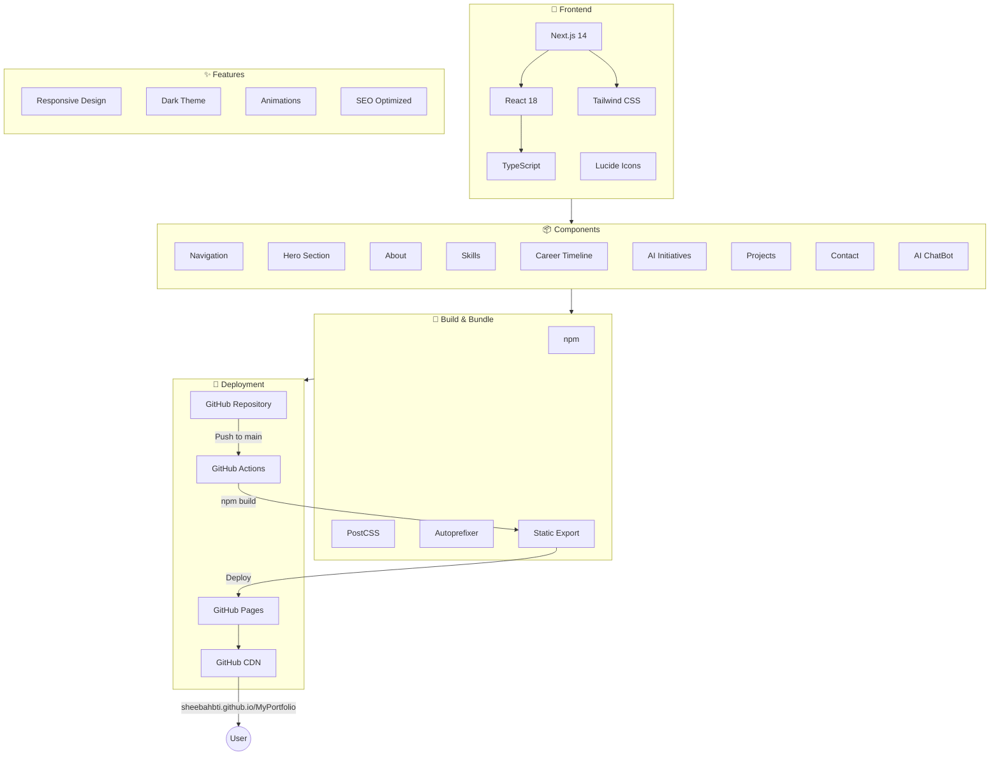

# Portfolio Architecture

🌐 **Live Site**: [https://sheebahbti.github.io/MyPortfolio/](https://sheebahbti.github.io/MyPortfolio/)

## System Architecture



## Deployment Pipeline

```mermaid
flowchart LR
    subgraph DEV["👩‍💻 Development"]
        CODE[Write Code]
        LOCAL[npm run dev<br/>localhost:3000]
    end

    subgraph VCS["📁 Version Control"]
        COMMIT[git commit]
        PUSH[git push origin main]
    end

    subgraph CI["⚙️ CI/CD Pipeline"]
        TRIGGER[GitHub Actions<br/>Triggered]
        INSTALL[npm ci]
        BUILD[npm run build]
        ARTIFACT[Upload Artifact]
    end

    subgraph DEPLOY["🌐 Deployment"]
        PAGES[GitHub Pages]
        LIVE[Live Site<br/>sheebahbti.github.io/MyPortfolio]
    end

    CODE --> LOCAL
    LOCAL --> COMMIT
    COMMIT --> PUSH
    PUSH --> TRIGGER
    TRIGGER --> INSTALL
    INSTALL --> BUILD
    BUILD --> ARTIFACT
    ARTIFACT --> PAGES
    PAGES --> LIVE
```



## Tech Stack

| Layer | Technology | Purpose |
|-------|------------|---------|
| **Frontend Framework** | Next.js 14 | React framework with static export |
| **UI Library** | React 18 | Component-based UI |
| **Language** | TypeScript | Type safety |
| **Styling** | Tailwind CSS | Utility-first CSS |
| **Icons** | Lucide React | Icon library |
| **Build Tools** | PostCSS, Autoprefixer | CSS processing |
| **Version Control** | Git + GitHub | Source code management |
| **CI/CD** | GitHub Actions | Automated build & deploy |
| **Hosting** | GitHub Pages | Free static hosting + CDN |
| **Domain** | github.io | Free subdomain |

## Component Structure

```
src/
├── app/
│   ├── globals.css      # Global styles + Tailwind
│   ├── layout.tsx       # Root layout + SEO metadata
│   └── page.tsx         # Main page composition
└── components/
    ├── Navigation.tsx   # Responsive navbar with mobile menu
    ├── Hero.tsx         # Hero section with profile
    ├── About.tsx        # Summary + leadership philosophy
    ├── Skills.tsx       # Skills grid by category
    ├── Timeline.tsx     # Interactive career timeline
    ├── AIInitiatives.tsx # AI projects showcase
    ├── Projects.tsx     # Key achievements with metrics
    ├── Contact.tsx      # Contact information
    └── ChatBot.tsx      # AI-powered Q&A widget
```

## Key Features

### 🤖 AI ChatBot
- Pattern-matching based Q&A about experience
- Knowledge base with career, skills, and achievements
- Floating widget with typing animation

### 📱 Responsive Design
- Mobile-first approach
- Collapsible navigation
- Adaptive layouts for all screen sizes

### ⚡ Performance
- Static site generation (SSG)
- Optimized assets via Next.js
- CDN delivery via GitHub Pages

### 🎨 Design
- Dark theme with gradient accents
- Smooth animations and transitions
- Card hover effects

## Infrastructure Cost

| Service | Cost |
|---------|------|
| GitHub Repository | Free |
| GitHub Actions | Free (2,000 mins/month) |
| GitHub Pages | Free |
| Custom Domain | Optional (~$12/year) |
| **Total** | **$0/month** |

## Future Enhancements

- [ ] OpenAI/Claude API integration for smarter chatbot
- [ ] Blog section with MDX
- [ ] Project detail pages
- [ ] Analytics integration
- [ ] Custom domain setup
